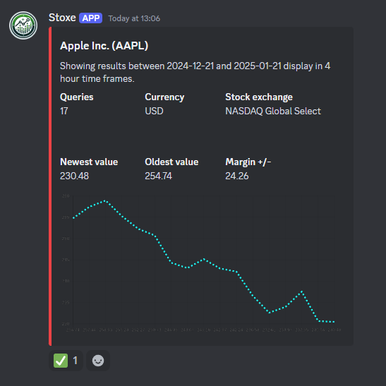

# StoxeBot

StoxeBot is a discord bot which displays live stock market data.
## Implementation
1. Create a new Node.js project
2. Copy the files from the repository to be used as a template.
3. Run the following commands to install all necessary dependencies
```bash
npm install discord.js dotenv mongodb mongoose node nodemon quickchart-js
```
4. You will need to generate the following API keys for the .env file:
```python
TOKEN = # Your discord API token
FMP_KEY = # Your FMP token. Can be found here: https://site.financialmodelingprep.com/developer/docs
MONGO_URI = # The token for your MongoDB cluster (You will need to create an account and a cluster first)
POLYGON_KEY = # The token for your Polygon.io account
```
5. Using this and the discord token you have already generated, you can now create a discord bot/application and test it on your server! Just don't forget to run your code through your terminal first:

```bash
node .
```

## Demonstration

Always ping the bot prior to any command; The core command inclues just typing out the ticker symbol for any stock in all caps:
```bash
@Stoxe AAPL
```
This returns the following discord message:



In case you click on the emoji at the bottom, you will be registered as a user in the database and the stock will be added to your user ID as a bookmark.

You can now use the keyword 'BOOKMARKS' to display all the saved stocks on your account at once:
```bash
@Stoxe BOOKMARKS
```

## Roadmap

## Contributing

Pull requests are welcome. For major changes, please open an issue first
to discuss what you would like to change.

Please make sure to update tests as appropriate.

## License

[MIT](https://choosealicense.com/licenses/mit/)
